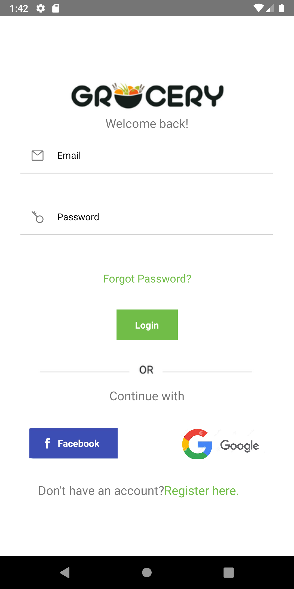
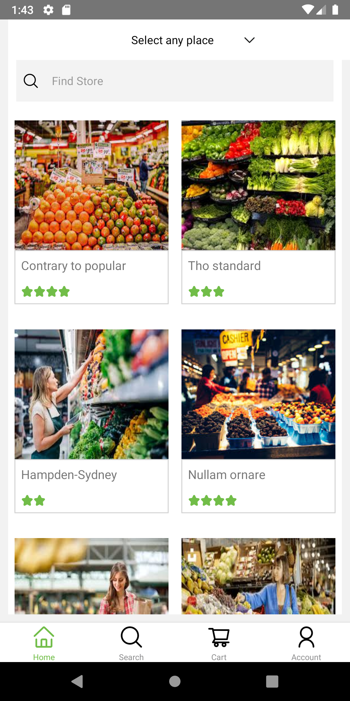
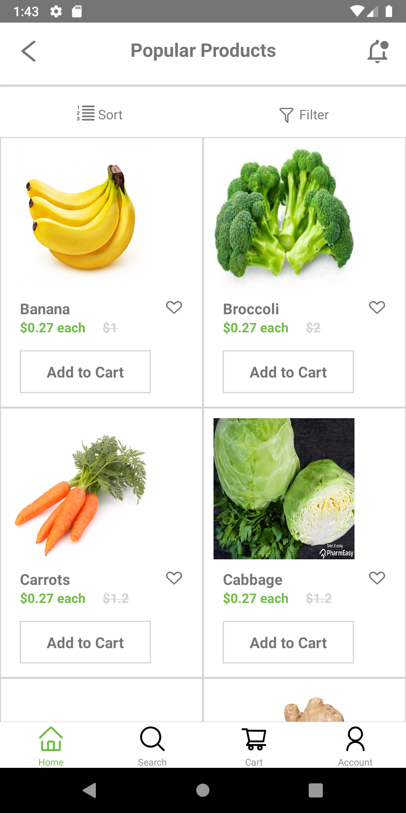
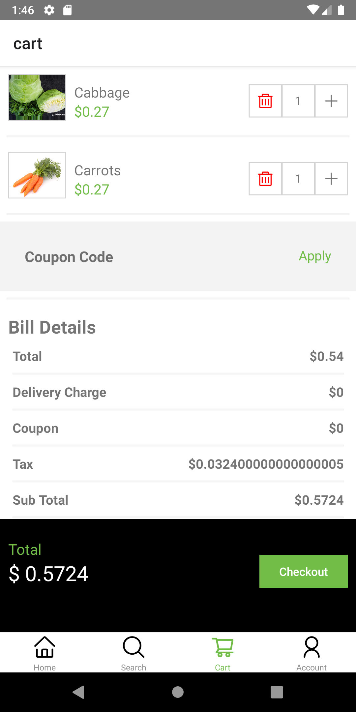
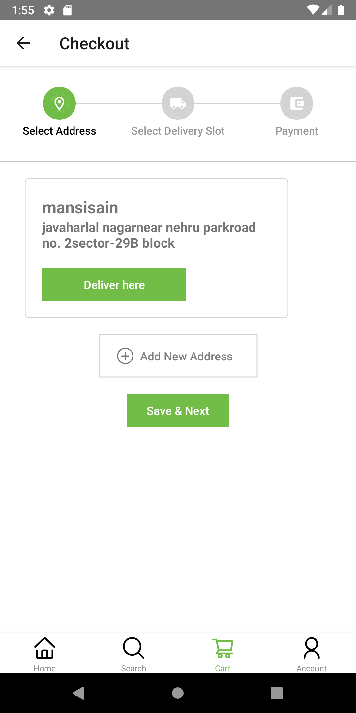
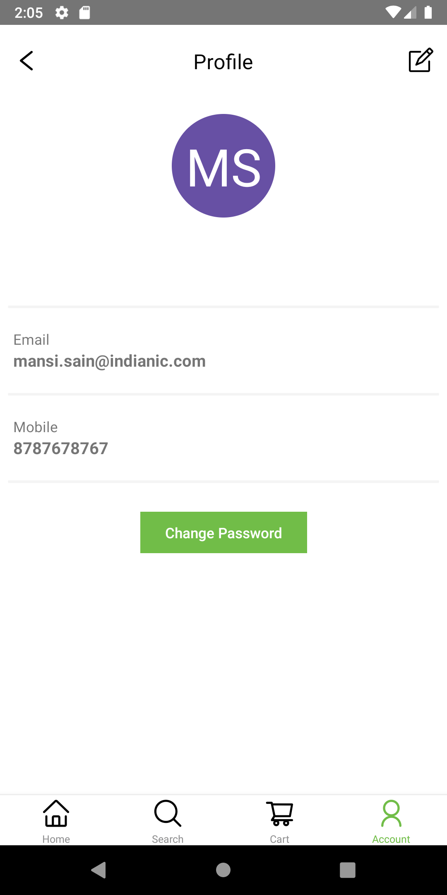

# Grocery 

 An ecommerce app to polish react native skills

## Features 

- Authentication
- Categories ->Products ->Product Details
- Database Server(Firestore) + Local(Redux)
- Add/Remove from Cart
- Pull to refresh
- Redux thunk middleware for API
- Remote config

## Preview 📸

|       |        |
|------------|------------|
| | 

|       |        |
|------------|------------|
| | 

|       |        |
|------------|------------|
| | 

### API
- https://grocery-backend-in.vercel.app/products/popular

## How to Run 🚀
- Clone the repo `git clone https://github.com/mansisain/grocery.git`
- Install the dependencies `npm install or yarn install`
- Run it `npm start or yarn start`
